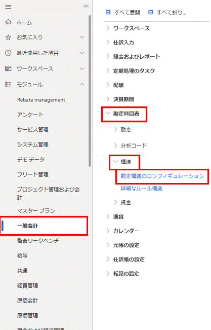
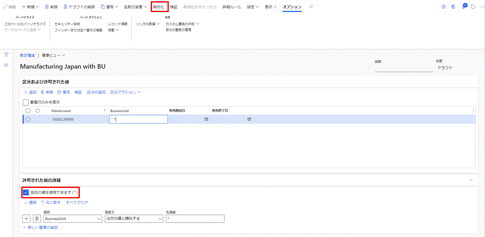
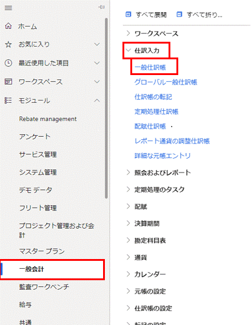

こんにちは、日本マイクロソフト Dynamics ERP サポートチームの道浦です。  
この記事では、 Dynamics 365 Finance and Operations にて、 財務分析コードで空白の仕訳が発生した際の訂正で必要な手順を紹介します。

<!-- more -->
## 検証に用いた製品・バージョン
Dynamics 365 Finance and Operations      
Application version: 10.0.28    
Platform version: PU52  

## 財務分析コードで空白の仕訳が発生した際の訂正手順

1. Finance and Operations のホーム画面を起動する

2. モジュール > 一般会計 > 勘定科目表 > 勘定構造のコンフィギュレーションの順にクリックします。
    

3. 該当の勘定構造を選択します。

4. 「編集」をクリックします。

5. 「許可された値の詳細」にある「空白の値を使用できます("")」にチェックを入れ、「有効化」をクリックします。
    

6. 一般会計 > 仕分入力 > 一般仕訳帳 の順にクリックします。
    

7. 「+ 新規」をクリックし、「名前」を選択のうえ、「明細行」をクリックします。
    

8. 「勘定」にて訂正したい勘定科目を入力し、金額を入力します。
    

9. 「転記」をクリックします。  
    **これで逆仕訳が完了します。**

10. 一般会計 > 仕訳入力 > 一般仕訳帳の順にクリックします。

11. 「+ 新規」をクリックし、"名前"を選択のうえ、「明細行」をクリックします。

12. 「+ 新規」をクリックし、明細行を追加します。

13. 「勘定」にて財務分析コードを含めた正しい勘定科目を入力し、金額を入力します。
    

14. 「転記」をクリックします。  
    **これで正しい仕訳が完了します。**

---
## おわりに  

以上、財務分析コードで空白の仕訳が発生した際の訂正で必要な手順についてご紹介しました。
より詳細な情報が必要な場合、弊社テクニカルサポート, Customer Success Account Manager (CSAM), Customer Engineer (CE) までお問い合わせください。
